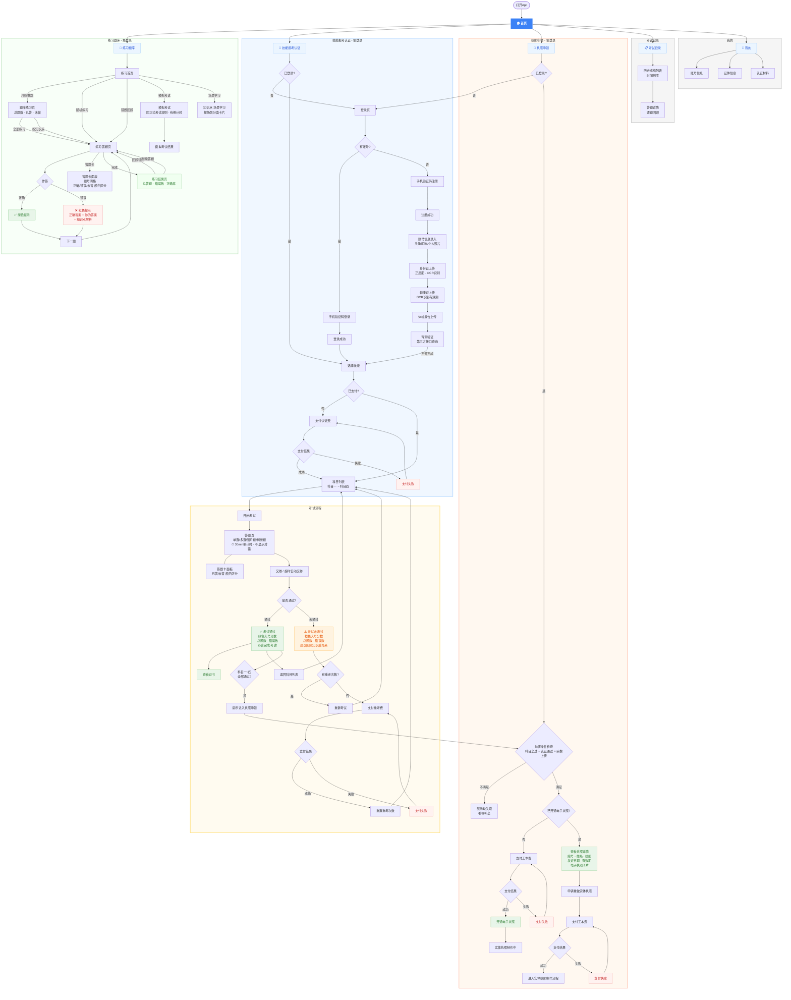

# 26年3月 - 执照认证系统
执照认证系统账号信息、考试模块的设计

## 执照认证系统规划

### 对象

- 学员
- 培训师

---
## 主流程
打开App，默认进入题库，底部固定练习题库、技能认证、我的执照，个人中心四个按钮
├── 练习题库（免登录）
│   ├── 练习首页
│   │   ├── 顶部进度卡片：做题进度环形图、做题数、累计刷题、正确率
│   │   ├── "开始做题"按钮
│   │   ├── 快捷入口：随机练习 | 错题回顾 | 模拟考试
│   │   ├── 科目考试信息卡片：题目总数、模拟考试及格线、正式考试及格线及次数限制
│   │   │   └── "开始模拟考试"按钮
│   │   └── 知识点·场景学习：按场景分类的学习卡片（如厨房清洁、宠物毛发处理等）
│   ├── 题库练习页
│   │   ├── 统计概览：总题数 | 已答题 | 未做题
│   │   ├── "全部练习"按钮
│   │   └── 按知识点练习：职业认知与规范 | 文化清洁 | 业务场景 等分类
│   ├── 答题页
│   │   ├── 题目类型：单选（单选按钮）| 多选（勾选框）| 图片题（图片+选项）| 判断题
│   │   ├── 答题后即时反馈：
│   │   │   ├── 回答正确 → 绿色提示，自动进入下一题
│   │   │   └── 回答错误 → 红色提示 ✗ + 正确答案 + 你的答案 + 知识点解析
│   │   ├── 底部状态栏：正确数 · 错误数 · 当前题号/总题数
│   │   └── 答题卡面板：题号网格，已答/未答/正确/错误用不同颜色区分
│   └── 练习结果页
│       ├── "本次练习完成" + 图标
│       ├── 统计：总答题数 | 错误数 | 正确率
│       └── 操作按钮：回顾错题 | 继续答题
├── 技能报考认证
│   ├── 未登录 → 登录页
│   │   ├── 有账号 → 手机验证码登录 → 登录成功 → 返回
│   │   └── 无账号 → 手机验证码注册 → 注册成功 → 引导信息完善流程
│   │       └── 账号信息录入（头像/昵称/个人照片）
│   │         → 身份证上传（正反面，OCR识别）
│   │         → 健康证上传（OCR识别有效期）
│   │         → 体检报告上传
│   │         → 背调验证（调用第三方接口，输入姓名+身份证号自动查询）
│   │         → 完善完成 → 返回原页面
│   ├── 选择技能 → 材料前置检查（个人照片+身份证+健康证+体检报告+背调验证全部完成）
│   │   ├── 材料未齐全 → 进入"补全材料"引导页（单页分步完成所有缺失项）
│   │   └── 材料齐全 → 未支付 → 支付认证费
│   │                   ├── 支付成功 → 进入科目列表
│   │                   └── 支付失败 → 重试/返回
│   └── 已支付 → 科目列表（科目一~四）
│       ├── 材料审核状态检查
│       │   ├── 自动审核项：健康证（AI审核）、体检报告（AI审核）、背调验证（第三方接口确认即通过）
│       │   ├── 人工审核项：个人照片、身份证
│       │   ├── 审核中 → 提示"材料审核中，请等待审核通过后参加考试"
│       │   ├── 审核不通过 → 提示不通过原因，引导重新上传
│       │   └── 全部审核通过 → 可以开始考试
│       └── 开始考试 → 答题页
│           ├── 题目类型：单选 | 多选 | 图片题 | 判断题（同练习题库）
│           ├── 顶部倒计时（30min），超时自动交卷
│           ├── 答题过程中不显示对错，仅记录答案
│           ├── 答题卡面板：题号网格，已答/未答颜色区分
│           └── 交卷 → 考试结果页
│               ├── 通过 → 考试名称 + 大号绿色分数 + 总题数 + 错误数
│               │       + "恭喜你完成了本次考试！" + "查看证书"按钮
│               ├── 未通过 → 考试名称 + 大号橙色分数 + 总题数 + 错误数
│               │         + "考试不通过，建议回顾知识后再来考试"
│               │   ├── 剩余重考次数 > 0 → "重新考试"按钮
│               │   └── 剩余重考次数 = 0 → 支付重考费 → 支付成功 → 重置重考次数 → 重考
│               │                         └── 支付失败 → 重试/返回
│               └── 科目一~四全部通过 → 提示进入执照申领流程
├── 执照申领（需登录）
│   ├── 前置条件：科目一~四全部通过 + 认证材料审核通过 + 头像已上传
│   ├── 条件未满足 → 展示缺失项，引导补全
│   └── 条件满足
│       ├── 未开通过电子执照 → 支付工本费
│       │   ├── 支付成功 → 开通电子执照 + 显示"实体执照制作中"
│       │   └── 支付失败 → 重试/返回
│       └── 已开通电子执照 → 查看执照详情
│           ├── 执照详情：执照编号、姓名、技能名称、发证日期、有效期、电子执照卡片
│           └── 申请重做（实体执照）→ 支付工本费 → 支付成功 → 进入实体执照制作流程
│                                                   └── 支付失败 → 重试/返回
├── 考试记录 → 历史成绩列表 → 答题详情
└── 个人中心
    ├── 蓝色渐变头卡（头像/姓名/角色/手机号）
    ├── 认证材料图标栏（点击进入对应上传/编辑页）：
    │   ├── 身份认证（身份证上传）
    │   ├── 健康证（健康证上传）
    │   ├── 体检报告（体检报告上传）
    │   └── 背调验证（调用第三方接口验证）
    │   每项显示审核状态：未上传(未验证)/审核中/已通过/不通过
    ├── 功能列表：
    │   ├── 账号信息（头像/昵称/个人照片，个人照片有审核状态）
    │   ├── 考试记录
    │   └── 退出登录

后台

├── 数据看板
│   ├── 执照统计：总数、正常、冻结、已吊销
│   ├── 考试统计：报名人数、通过率、待审核数
│   └── 认证审核统计：待审核、已通过、不通过
├── 执照管理
│   ├── 执照列表
│   │   ├── 列表字段：执照编号/姓名、性别、出生年月、状态（正常/冻结/已吊销）、执照分、认证期间、下次年审、培训单位
│   │   ├── 搜索：执照编号或姓名模糊搜索
│   │   └── 操作：
│   │       ├── 电子执照：查看电子执照详情
│   │       ├── 违纪详情：查看该人员违纪记录及扣分明细
│   │       ├── 激活：对冻结状态的执照进行激活恢复
│   │       └── 吊销：吊销执照，执照分清零，状态变更为已吊销
│   └── 执照分规则
│       ├── 初始分：满分（如24分）
│       ├── 违规扣分 → 分值降低 → 低于阈值触发冻结
│       └── 冻结后需培训合格方可激活
├── 考生管理
│   ├── 考生列表
│   │   ├── 列表字段：账号ID、头像、昵称、姓名、执照编号、状态（有效/失效）、手机、城市
│   │   ├── 搜索：姓名/手机号搜索
│   │   ├── 筛选：状态（全部/有效/失效）、城市
│   │   └── 操作：编辑、考试管理（跳转该考生考试详情）
│   ├── 添加考生：弹窗填写昵称、姓名、手机号、微信号、城市，自动生成执照编号、上传身份证、健康证、体检报告、进行背调验证
│   └── 编辑考生：弹窗编辑基本信息及状态切换
├── 认证审核
│   ├── 筛选标签：全部 / 待审核 / 已通过 / 不通过
│   ├── 列表字段：考生姓名、手机号、材料类型、提交时间、状态、材料预览
│   ├── 人工审核项：
│   │   ├── 头像审核：审核个人照片是否符合要求
│   │   └── 身份证审核：审核身份证信息是否真实有效
│   ├── 自动审核项（无需人工操作）：
│   │   ├── 健康证 → AI自动审核
│   │   ├── 体检报告 → AI自动审核
│   │   └── 背调验证 → 第三方接口确认即通过
│   └── 操作：
│       ├── 通过：审核通过，考生端状态同步更新
│       └── 不通过：填写不通过原因，考生端提示重新上传
├── 题目库管理
│   ├── 题目列表
│   │   ├── 列表字段：题目编号、题目内容、类型（单选/多选/判断）、分类、难度、创建人、创建时间、状态（生效/失效）
│   │   ├── 搜索：题目内容关键词搜索
│   │   ├── 筛选：所有分类、所有状态、题目时间段
│   │   └── 操作：编辑、删除、启用/禁用
│   ├── 新建题目
│   │   ├── 选择题目类型：单选 / 多选 / 判断
│   │   ├── 填写题目内容（富文本）
│   │   ├── 设置选项（支持图片选项）
│   │   ├── 标记正确答案
│   │   ├── 设置分类、难度、分值
│   │   └── 知识点解析（答错时展示）
│   └── 批量操作：导入题目、导出题目
├── 考试管理
│   ├── 考试记录列表
│   │   ├── 列表字段：考试编号、学员姓名、手机号、认证技能、考试科目、得分、总分、及格分、结果（通过/未通过）、考试时间
│   │   ├── 搜索：学员姓名、手机号
│   │   ├── 筛选：认证技能、考试科目、考试结果、考试时间段
│   │   └── 操作：查看答题详情、导出
│   └── 答题详情（弹窗）
│       └── 逐题展示：题目、考生答案、正确答案、是否正确、知识点解析
├── 报名审核
│   ├── 筛选标签：待审核 / 已通过 / 已拒绝
│   ├── 列表字段：序号、申请人、手机号、报名科目、人脸识别结果、申请时间、审核状态
│   └── 操作：审核（通过/拒绝）
├── 成绩中心
│   ├── 列表字段：考试编号、考试名称、考试描述、考生人数、考生姓名、总分、及格分、得分、考试时间
│   ├── 搜索：考试名称搜索
│   ├── 筛选：所有状态
│   └── 操作：导出成绩
└── 违规管理
    ├── 违规列表：违规人员、违规类型、违规时间、扣分分值、处理状态
    └── 操作：查看详情、处理违规（扣分/冻结/吊销）

### 移动端端主流程图

### 后台主流程图

```mermaid
flowchart TD
    Admin([管理员登录后台]) --> Dashboard[📊 数据看板]
    Admin --> LicMgmt[🪪 执照管理]
    Admin --> StuMgmt[👥 考生管理]
    Admin --> AuditMgmt[✅ 认证审核]
    Admin --> QBank[📚 题目库管理]
    Admin --> ExamMgmt[📝 考试管理]
    Admin --> RegAudit[📋 报名审核]
    Admin --> ScoreCenter[🏆 成绩中心]
    Admin --> VioMgmt[⚠️ 违规管理]

    %% ═══════════════════════════════════
    %% 数据看板
    %% ═══════════════════════════════════
    subgraph SG_Dash [数据看板]
        Dashboard --> DashLic[执照统计<br/>总数·正常·冻结·已吊销]
        Dashboard --> DashExam[考试统计<br/>报名人数·通过率·待审核数]
        Dashboard --> DashAudit[认证审核统计<br/>待审核·已通过·不通过]
    end

    %% ═══════════════════════════════════
    %% 执照管理
    %% ═══════════════════════════════════
    subgraph SG_Lic [执照管理]
        direction TB
        LicMgmt --> LicList[执照列表<br/>编号·姓名·性别·状态<br/>执照分·认证期间·年审日期·培训单位]
        LicList --> LicView[查看电子执照]
        LicList --> LicVio[违纪详情<br/>扣分明细]
        LicList --> LicActivate[激活<br/>冻结→正常]
        LicList --> LicRevoke[吊销<br/>执照分清零]
    end

    %% ═══════════════════════════════════
    %% 考生管理
    %% ═══════════════════════════════════
    subgraph SG_Stu [考生管理]
        direction TB
        StuMgmt --> StuList[考生列表<br/>搜索·筛选状态/城市]
        StuList --> StuAdd[添加考生<br/>昵称·姓名·手机·城市<br/>自动生成执照编号]
        StuList --> StuEdit[编辑考生<br/>修改信息·切换状态]
        StuList --> StuExam[考试管理<br/>跳转该考生考试详情]
    end

    %% ═══════════════════════════════════
    %% 认证审核
    %% ═══════════════════════════════════
    subgraph SG_Audit [认证审核]
        direction TB
        AuditMgmt --> AuditFilter[筛选：全部/待审核/已通过/不通过]
        AuditFilter --> AuditManual[人工审核项<br/>头像审核·身份证审核]
        AuditFilter --> AuditAuto[自动审核项<br/>健康证AI·体检报告AI·背调接口]
        AuditManual --> AuditPass[通过 → 考生端同步更新]
        AuditManual --> AuditReject[不通过 → 填写原因<br/>考生端提示重新上传]
    end

    %% ═══════════════════════════════════
    %% 题目库管理
    %% ═══════════════════════════════════
    subgraph SG_QBank [题目库管理]
        direction TB
        QBank --> QList[题目列表<br/>编号·内容·类型·分类<br/>难度·状态]
        QList --> QAdd[新建题目<br/>类型·内容·选项·正确答案<br/>分类·难度·知识点解析]
        QList --> QEdit[编辑题目]
        QList --> QImport[批量导入/导出]
    end

    %% ═══════════════════════════════════
    %% 考试管理
    %% ═══════════════════════════════════
    subgraph SG_ExamMgmt [考试管理]
        direction TB
        ExamMgmt --> ExamList[考试列表<br/>编号·名称·题目数·总分<br/>及格分·通过率·状态]
        ExamList --> ExamCreate[新建考试<br/>名称·总分·及格分·时长<br/>次数限制]
        ExamCreate --> ExamPaper{组卷方式}
        ExamPaper --> ManualSelect[手动选题<br/>从题库勾选]
        ExamPaper --> AutoSelect[随机组卷<br/>按分类+难度+数量抽题]
        ExamList --> ExamDetail[考试详情<br/>考生信息·技能科目面板<br/>科目状态·考试记录]
        ExamDetail --> AnswerDetail[答题详情<br/>逐题：题目·考生答案<br/>正确答案·是否正确]
    end

    %% ═══════════════════════════════════
    %% 报名审核
    %% ═══════════════════════════════════
    subgraph SG_Reg [报名审核]
        direction TB
        RegAudit --> RegFilter[筛选：待审核/已通过/已拒绝]
        RegFilter --> RegList[报名列表<br/>申请人·手机·报名科目<br/>人脸识别·申请时间]
        RegList --> RegPass[审核通过]
        RegList --> RegReject[审核拒绝]
    end

    %% ═══════════════════════════════════
    %% 成绩中心
    %% ═══════════════════════════════════
    subgraph SG_Score [成绩中心]
        direction TB
        ScoreCenter --> ScoreList[成绩列表<br/>考试编号·名称·考生<br/>总分·及格分·得分·时间]
        ScoreList --> ScoreExport[导出成绩]
    end

    %% ═══════════════════════════════════
    %% 违规管理
    %% ═══════════════════════════════════
    subgraph SG_Vio [违规管理]
        direction TB
        VioMgmt --> VioList[违规列表<br/>违规人员·类型·时间<br/>扣分分值·处理状态]
        VioList --> VioHandle[处理违规]
        VioHandle --> VioDeduct[扣分]
        VioHandle --> VioFreeze[冻结执照]
        VioHandle --> VioRevoke2[吊销执照]
    end

    %% ═══════ 样式 ═══════
    style Admin fill:#1F2937,color:#fff,stroke:none,font-weight:bold
    style Dashboard fill:#EBF5FF,color:#1D4ED8,stroke:#93C5FD
    style LicMgmt fill:#EBF5FF,color:#1D4ED8,stroke:#93C5FD
    style StuMgmt fill:#EBF5FF,color:#1D4ED8,stroke:#93C5FD
    style AuditMgmt fill:#EBF5FF,color:#1D4ED8,stroke:#93C5FD
    style QBank fill:#EBF5FF,color:#1D4ED8,stroke:#93C5FD
    style ExamMgmt fill:#EBF5FF,color:#1D4ED8,stroke:#93C5FD
    style RegAudit fill:#EBF5FF,color:#1D4ED8,stroke:#93C5FD
    style ScoreCenter fill:#EBF5FF,color:#1D4ED8,stroke:#93C5FD
    style VioMgmt fill:#EBF5FF,color:#1D4ED8,stroke:#93C5FD

    style AuditPass fill:#E8F5E9,color:#2E7D32,stroke:#81C784
    style AuditReject fill:#FFF2F0,color:#C62828,stroke:#EF9A9A
    style RegPass fill:#E8F5E9,color:#2E7D32,stroke:#81C784
    style RegReject fill:#FFF2F0,color:#C62828,stroke:#EF9A9A
    style LicRevoke fill:#FFF2F0,color:#C62828,stroke:#EF9A9A
    style VioRevoke2 fill:#FFF2F0,color:#C62828,stroke:#EF9A9A
    style LicActivate fill:#E8F5E9,color:#2E7D32,stroke:#81C784

    style SG_Dash fill:#F0F7FF,stroke:#93C5FD,stroke-width:2px
    style SG_Lic fill:#FFF8F0,stroke:#FFAB91,stroke-width:2px
    style SG_Stu fill:#F0F7FF,stroke:#93C5FD,stroke-width:2px
    style SG_Audit fill:#FFFBF0,stroke:#FFD54F,stroke-width:2px
    style SG_QBank fill:#F8FFF8,stroke:#A5D6A7,stroke-width:2px
    style SG_ExamMgmt fill:#F8FFF8,stroke:#A5D6A7,stroke-width:2px
    style SG_Reg fill:#FFFBF0,stroke:#FFD54F,stroke-width:2px
    style SG_Score fill:#F5F5F5,stroke:#BDBDBD,stroke-width:2px
    style SG_Vio fill:#FFF2F0,stroke:#EF9A9A,stroke-width:2px
```

## 补充说明

### 登录逻辑细节

1. **登录验证**：访问内部页面时先判断是否登录，未登录跳转登录页面
2. **协议**：点击后展示协议信息，未勾选协议时提交会弹窗提示确认勾选
3. **微信授权登录**
   - 以手机号码为唯一判断，未注册过则自动注册
   - 提前设计账号中心，支持不同平台创建账号（微信、好慷在家）
4. **手机验证码登录/注册**
   - 图形验证码：点击更换，验证通过后获取验证码按钮可点击
   - 验证码提交：验证通过进行登录并缓存状态，验证失败提示重试
5. 登录成功后跳转到触发登录的页面

### 支付中心

> 对接微信支付

- 接入微信支付
- 订单提交页
- 支付成功/失败页面
- 申请退款

### 证件校验规则

- **OCR交叉校验**：上传身份证/健康证后OCR自动识别有效期及姓名、证件号，与账号信息交叉校验（防止上传他人证件）。有效期到期提示过期，任何时候可重新上传
- **个人照片AI验证**：上传后使用AI接口进行人像验证，验证失败提示具体原因（如"未检测到人脸"、"检测到多人"、"照片模糊"），引导重新上传

### 执照发放规则

- 技能下科目一与科目四考试通过后获得执照（执照发放逻辑在执照申领模块）

### 技能配置（TODO：后续补充）

- 技能的创建、编辑、删除
- 技能关联的考试配置

### 角色权限控制

- 培训师
- 培训中心负责人
- 超级管理员：所有权限

